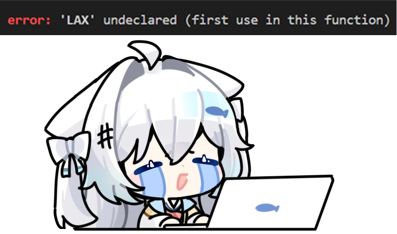

# Lab 12 - Final Work

**Academic Cooperation**  
North Minzu University × Chiang Mai University  
Academic Year 2024

---

## 👤 Personal Information

| Field | Info |
|-------|------|
| **Name** | Wang Liangxu |
| **Student ID** | 20242189 |
| **Major** | Software Engineering |
| **Photo** |  |

---

## 🌐 Application URLs

| Application | URL |
|-------------|-----|
| **Personal Website** | [http://34.201.105.203](http://34.201.105.203) |
| **Todo App** | [http://34.201.105.203:8080](http://34.201.105.203:8080) |

---

## 📁 Project Structure

```
├── index.html                     # Personal homepage
├── Dockerfile                     # Docker image for personal site
├── docker-compose.yml             # Orchestrates both applications
├── images/
│   └── 5.jpg                      # Profile photo
├── todo/
│   ├── index.html                 # Todo application (frontend only)
│   └── Dockerfile                 # Docker image for todo app
└── .github/workflows/
    └── deploy.yml                 # CI/CD — auto build & push to ghcr.io
```

---

## 🚀 How to Run

### Local Development

```bash
# Start both applications
docker compose up -d --build

# Open in browser
# http://localhost     → Personal website
# http://localhost:8080 → Todo app
```


---

## 🤖 CI/CD Pipeline

On every push to `main` branch, GitHub Actions:
1. Checks out the code
2. Logs in to GitHub Container Registry (ghcr.io)
3. Builds the Docker image
4. Pushes the image to `ghcr.io/lax-822/lab12/my-site:latest`

---

## 📝 Notes

- **GitHub Repository**: [LAX-822/Lab12](https://github.com/LAX-822/Lab12)
- **Team Size**: 1 (solo)
- **Docker Compose** runs two services on the same server:
  - `my-site` — Personal homepage (port 80)
  - `todo-app` — Todo application (port 8080)

  ## Team Info
Member1:Wang Liangxu ID 20242189  Work rate 50%
Member2:Cai Junru    ID 20242189  Work rate 50%
